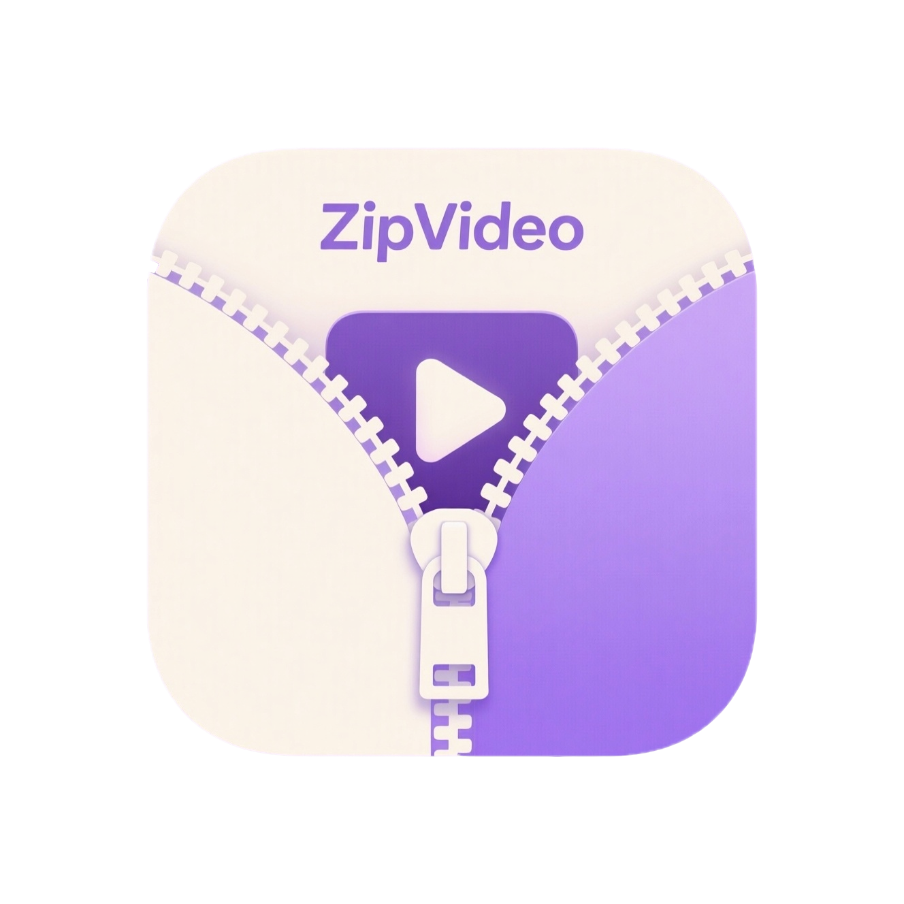

# 隐私政策

[English](privacy_policy.md) | [简体中文](privacy_policy_zh.md)

  

最近更新日期：2026年4月25日

## 简介

ZipVideo（“我们”）尊重用户的隐私。本隐私政策说明了您在使用我们的移动应用程序时，我们如何收集、使用、披露和保护您的信息。

## 数据处理

ZipVideo 的设计理念是隐私优先：
- **本地处理**：所有视频压缩均在您的设备上本地完成。
- **无数据收集**：我们不收集、不存储，也不会将您的任何个人数据或视频文件传输到任何外部服务器。

## 权限说明

为了正常运行，应用可能会请求以下权限：
- **相册/媒体库**：用于选择需要压缩的视频，并将压缩后的结果保存到相册。

## 政策变更

我们可能会不时更新隐私政策。建议您定期查看此页面以了解任何更改。

## 联系我们

如果您对我们的隐私政策有任何疑问或建议，请随时与我们联系。
